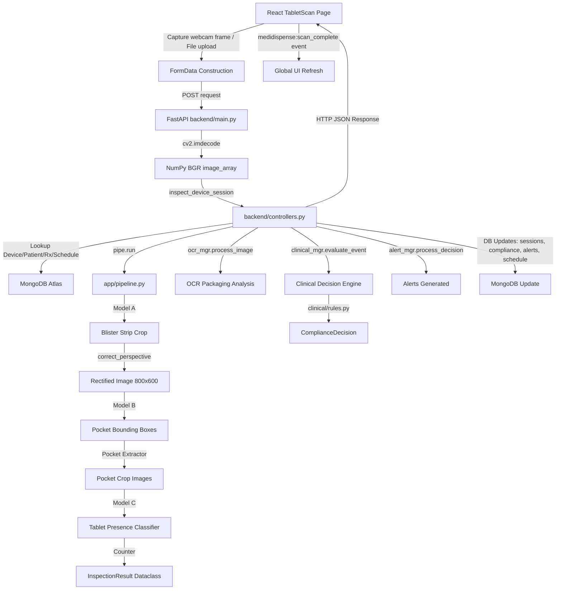

# ESP32 Camera Integration Map (MediDispense MK2 Project)

This document provides a comprehensive integration blueprint for introducing the physical ESP32-S3 WROOM N16R8 Cam module as the primary image acquisition device for the MediDispense system.

---

## 1. Current Image Input Path

An image currently progresses through the system via the following components:



### Exact Code References
*   **Frontend UI Entry:** [TabletScan.jsx](file:///c:/DEV/Projects/College_Projects/ProjectWork/ProjectWork/core/medidispense-ui/src/pages/TabletIdentification/TabletScan.jsx#L198-L290)
    *   *Function:* `runScan()` constructs `FormData`, appends `file` (a JPEG Blob) and fallback variables `total_slots="10"` and `missing_count="0"`.
    *   *API Request:* `fetch(`${API_BASE}/api/v1/devices/${devId}/inspection`, { method: "POST", body: fd })`.
*   **Backend Entry Point:** [backend/main.py](file:///c:/DEV/Projects/College_Projects/ProjectWork/ProjectWork/core/backend/main.py#L582-L627)
    *   *Function:* `inspect_device(device_id: str, file: UploadFile = File(None), ...)`
    *   *Decoding:* `cv2.imdecode(np.frombuffer(contents, np.uint8), cv2.IMREAD_COLOR)` producing the BGR `image_array`. It forces `raw_inspection = None` if a file is present to run the live model pipeline instead of a mock fallback.
*   **Controller Orchestration:** [backend/controllers.py](file:///c:/DEV/Projects/College_Projects/ProjectWork/ProjectWork/core/backend/controllers.py#L91-L525)
    *   *Function:* `inspect_device_session(device_id, image_array, raw_inspection, simulated_ocr_text)`
    *   *Lookups:* `self.dev_repo.find_by_id(device_id)`, `self.pat_repo.find_by_id(patient_id)`, `self.rx_repo.find_by_patient_id(patient_id)`.
    *   *Schedule Window Resolution:* Queries `daily_schedule` and filters for pending or missed schedules for the patient within a 5-minute pre/post window.
*   **AI Vision Pipeline:** [app/pipeline.py](file:///c:/DEV/Projects/College_Projects/ProjectWork/ProjectWork/core/app/pipeline.py#L110-L226)
    *   *Function:* `Pipeline.run(image)`
    *   *Model A (Strip Detector):* Loads [ModelA_v1.0.pt](file:///c:/DEV/Projects/College_Projects/ProjectWork/ProjectWork/core/models/production/ModelA_v1.0.pt) (YOLO) and returns crop coordinates.
    *   *Perspective Correction:* [pipeline/perspective.py](file:///c:/DEV/Projects/College_Projects/ProjectWork/ProjectWork/core/pipeline/perspective.py#L11-L58) -> `correct_perspective(image, output_width=800, output_height=600)` warping the strip into a standard rectilinear format.
    *   *Model B (Pocket Detector):* Loads [ModelB_v1.0.pt](file:///c:/DEV/Projects/College_Projects/ProjectWork/ProjectWork/core/models/production/ModelB_v1.0.pt) (YOLO) to detect pocket coordinates.
    *   *Model C (Tablet Classifier):* Loads [ModelC_v1.0.pt](file:///c:/DEV/Projects/College_Projects/ProjectWork/ProjectWork/core/models/production/ModelC_v1.0.pt) to run batch inference on each pocket crop, classifying them as `present` or `missing`.
*   **OCR Subsystem:** [ocr/manager.py](file:///c:/DEV/Projects/College_Projects/ProjectWork/ProjectWork/core/ocr/manager.py#L67-L111) -> `process_image(image, preprocess=True)`.
    *   *Preprocessing:* [ocr/preprocessing.py](file:///c:/DEV/Projects/College_Projects/ProjectWork/ProjectWork/core/ocr/preprocessing.py#L75-L93) -> `preprocess(image)` executing: `Grayscale -> CLAHE -> Denoise -> Sharpen -> Binarize`.
    *   *Extraction:* `self.backend.extract_text()` using EasyOCR or falling back to a mock handler.
*   **Clinical Decision Engine:** [clinical/manager.py](file:///c:/DEV/Projects/College_Projects/ProjectWork/ProjectWork/core/clinical/manager.py#L59-L110) -> `evaluate_event(event, prescription, identity, schedule)`. Uses [clinical/rules.py](file:///c:/DEV/Projects/College_Projects/ProjectWork/ProjectWork/core/clinical/rules.py) to assess compliance state, producing a `ComplianceDecision` (outcome e.g., `CORRECT_DOSE`, `DOSE_MISSED`, `EXTRA_DOSE`).
*   **Alert Engine:** [alerting/manager.py](file:///c:/DEV/Projects/College_Projects/ProjectWork/ProjectWork/core/alerting/manager.py#L64-L152) -> `process_decision(decision)`. Persists and dispatches alert messages (e.g. `Critical` wrong medicine, `Warning` missed dose).
*   **Database Persistence:** Handled in `InspectionController.inspect_device_session`:
    *   `inspection_sessions` (via `self.insp_repo.insert_session`)
    *   `compliance_decisions` (via `self.comp_repo.insert_one`)
    *   `alerts` (via `self.alert_repo.insert_many`)
    *   `daily_schedule` (via `self.sched_repo.update_status` updating status to `COMPLETED`, `MISSED`, or `OVERDOSE`)
    *   `devices` (via `self.dev_repo.collection.update_one` to update `last_scan` and `slots_used`)

---

## 2. Current Camera Implementation

The repository contains the following camera-related code:
1.  **Webcam / Browser Capture:** Exists in [TabletScan.jsx](file:///c:/DEV/Projects/College_Projects/ProjectWork/ProjectWork/core/medidispense-ui/src/pages/TabletIdentification/TabletScan.jsx#L162-L188). Uses standard browser APIs (`navigator.mediaDevices.getUserMedia` with `{ video: { facingMode: "environment" } }`) to grab a video stream, paint frames to an HTML5 canvas context, and generate a JPEG Blob using `canvas.toBlob()`.
2.  **Image Upload:** Exists in [TabletScan.jsx](file:///c:/DEV/Projects/College_Projects/ProjectWork/ProjectWork/core/medidispense-ui/src/pages/TabletIdentification/TabletScan.jsx#L191-L195) using a standard HTML file upload element.
3.  **Local OpenCV Camera Capture:** Exists in [detect_camera.py](file:///c:/DEV/Projects/College_Projects/ProjectWork/ProjectWork/core/detect_camera.py) (and a duplicate copy in [app/detect_camera.py](file:///c:/DEV/Projects/College_Projects/ProjectWork/ProjectWork/core/app/detect_camera.py)). Uses Python with `cv2.VideoCapture(device_id)` to capture frames locally in a loop, running real-time YOLO blister strip detection and displaying the annotated stream via `cv2.imshow()`.
4.  **ESP32-Specific Code / Hardware Interface:** None. There is currently no ESP32 code, micro-controller interface, or hardware communication layer anywhere in the repository.

---

## 3. Find the Best Integration Point

The **single best integration point** is the existing FastAPI REST endpoint:
*   **Route:** `POST /api/v1/devices/{device_id}/inspection` in [backend/main.py](file:///c:/DEV/Projects/College_Projects/ProjectWork/ProjectWork/core/backend/main.py#L582)

### Rationale
*   **Device Mapping:** The route already has `device_id` as a path parameter. When the ESP32 makes a request, it provides its identifier (e.g. `DEV-ARJUN-01`). The backend resolves the linked patient, prescription, and schedules automatically.
*   **Image Reception:** The endpoint expects an `UploadFile` as multipart/form-data under the field name `file`. The backend handles stream reading, JPEG decoding into a NumPy array, and feeds it directly to the existing vision + clinical pipelines.
*   **No Code Changes to AI Pipeline:** The backend is fully operational with this endpoint. Using it avoids duplicating code, creating parallel routes, or disturbing the core vision pipelines.

---

## 4. Proposed Data Flow

The minimum-change architecture uses **HTTP POST** over Wi-Fi.

```text
ESP32-S3 Cam
  ├── 1. Connects to local Wi-Fi
  ├── 2. Captures JPEG frame (OV2640)
  └── 3. Transmits HTTP POST to:
         http://<host>:8000/api/v1/devices/DEV-ARJUN-01/inspection
         Headers: Content-Type: multipart/form-data
         Body: binary JPEG data under name "file"
                 ↓
FastAPI Backend (FastAPI + Uvicorn)
  ├── 4. Decodes JPEG frame to NumPy array
  ├── 5. Executes YOLO + Perspective Warp + Classifier Pipeline
  ├── 6. Evaluates OCR + Clinical Decision Rules
  ├── 7. Updates MongoDB Collections (Sessions, Schedules, Alerts)
  └── 8. Returns HTTP 200 OK with compliance evaluation JSON
                 ↓
React UI Dashboard
  └── 9. Polls database stats every 30 seconds, automatically displaying new alerts/schedules
```

*   **Protocol Choice:** HTTP POST is chosen because the backend already supports it natively. Running WebSockets, MQTT, or MJPEG streaming is unnecessary, consumes more memory on the ESP32, and requires adding new server-side handlers, which increases architectural risk.

---

## 5. Exact Files That Would Need Modification

To integrate the physical camera with minimum disturbance:

### Backend Modifications (Optional/None)
No backend source files require modifications to receive the image. The existing endpoint already runs the pipeline. However:
1.  **[config.py](file:///c:/DEV/Projects/College_Projects/ProjectWork/ProjectWork/core/config.py) (Optional):** We may expose ESP32-specific camera parameters if needed (e.g. timeout thresholds), but this is not strictly mandatory.
2.  **[.env](file:///c:/DEV/Projects/College_Projects/ProjectWork/ProjectWork/core/.env) (Mandatory Deployment Config):** The API must be run binding to `0.0.0.0` (which is already configured in `backend/main.py`'s uvicorn launch code) so it accepts requests from the ESP32 on the local network.

### Frontend Modifications (Optional/Recommended)
The React dashboard polls the backend every 30 seconds via [App.jsx](file:///c:/DEV/Projects/College_Projects/ProjectWork/ProjectWork/core/medidispense-ui/src/App.jsx#L245), so any scan sent by the ESP32 will automatically reflect on the main dashboard screens. However, [TabletScan.jsx](file:///c:/DEV/Projects/College_Projects/ProjectWork/ProjectWork/core/medidispense-ui/src/pages/TabletIdentification/TabletScan.jsx) currently assumes a manual file upload/webcam capture.
To support real-time feedback on that specific page:
*   **[TabletScan.jsx](file:///c:/DEV/Projects/College_Projects/ProjectWork/ProjectWork/core/medidispense-ui/src/pages/TabletIdentification/TabletScan.jsx) (Optional / UI extension):** Add a "Physical Camera Scan" mode. In this mode, instead of requiring a local upload, the page polls `GET /verifications` or `GET /devices` for the selected device's latest scan timestamp every 3 seconds. Once a new scan is detected from the ESP32, the UI automatically updates with the results.

### Files to Remain Untouched
*   **DO NOT MODIFY** the vision pipeline code: [app/pipeline.py](file:///c:/DEV/Projects/College_Projects/ProjectWork/ProjectWork/core/app/pipeline.py), [pipeline/perspective.py](file:///c:/DEV/Projects/College_Projects/ProjectWork/ProjectWork/core/pipeline/perspective.py)
*   **DO NOT MODIFY** the clinical evaluation files: [clinical/manager.py](file:///c:/DEV/Projects/College_Projects/ProjectWork/ProjectWork/core/clinical/manager.py), [clinical/rules.py](file:///c:/DEV/Projects/College_Projects/ProjectWork/ProjectWork/core/clinical/rules.py)
*   **DO NOT MODIFY** the database module: [database/connection.py](file:///c:/DEV/Projects/College_Projects/ProjectWork/ProjectWork/core/database/connection.py), [database/repositories](file:///c:/DEV/Projects/College_Projects/ProjectWork/ProjectWork/core/database/repositories)

---

## 6. ESP32 Responsibility

The ESP32 firmware should execute lightweight device-level logic and delegate heavy lifting to the server:

### Expected Responsibilities
*   **Camera Initialization:** Initialize camera sensor (e.g. OV2640) at a suitable resolution (e.g. SVGA 800x600 or UXGA 1600x1200).
*   **Wi-Fi Connection:** Connect to a local Wi-Fi router; handle reconnection logic if the signal drops.
*   **Trigger Capture:** Wait for physical inputs (e.g., button press or IR proximity sensor detection) to capture a frame.
*   **Transmit Image:** Build a multipart HTTP POST request containing the JPEG image and transmit it to the backend endpoint.
*   **Status Indicators:** Drive status LEDs or buzzer to indicate connection state, capture status, success response, or error codes.
*   **Retries:** Retry transmission up to 3 times on temporary connection failures.

### Excluded Responsibilities (Do NOT move to ESP32)
*   **No ML/Inference:** No YOLO blister/pocket detection or classification.
*   **No OCR:** No text recognition.
*   **No Database Connectivity:** Do not query MongoDB Atlas directly.
*   **No Clinical Logic:** Do not determine compliance state (e.g., overdose or correct dose).

---

## 7. Backend Contract

To submit an image, the ESP32 must match the following contract:

*   **URL:** `http://<backend-ip-address>:8000/api/v1/devices/{device_id}/inspection`
    *   *Where `{device_id}` matches a registered device (e.g. `DEV-ARJUN-01`).*
*   **HTTP Method:** `POST`
*   **Content-Type:** `multipart/form-data`
*   **Request Payload Structure:**
    *   `file`: The binary JPEG frame data (MIME: `image/jpeg`, filename: `capture.jpg`).
*   **Expected Success Response (HTTP 200 OK):**
    ```json
    {
      "success": true,
      "data": {
        "session_id": "sess_...",
        "device_id": "DEV-ARJUN-01",
        "scan_time": "2026-08-30T21:35:04+05:30",
        "tablet_counts": {
          "total": 10,
          "present": 9,
          "missing": 1,
          "delta": -1
        },
        "compliance_decision": {
          "outcome": "CORRECT_DOSE",
          "reason": "Dose verified: patient removed 1 tablet."
        }
      }
    }
    ```
*   **Error Responses:**
    *   `HTTP 440 (Session Error)`: Device ID is unregistered.
    *   `HTTP 404 (Not Found)`: Patient record for this device is missing.
    *   `HTTP 400 (Bad Request)`: Missing prescription.
    *   `HTTP 409 (Conflict)`: No active pending/missed scan schedule found.
    *   `HTTP 500 (Server Error)`: Vision pipeline execution crash.

---

## 8. Frontend Impact

The React frontend has two modes of operation:
1.  **Dashboard/Alerts Pages:** No changes are required. The dashboard polls the backend every 30 seconds and will automatically show alerts, compliance updates, and logs created by the ESP32 scans.
2.  **Scan Console (`TabletScan.jsx`):** Requires optional changes only if users want real-time progress feedback on this page. We can introduce polling to query `/verifications` or `/devices` for updates.

---

## 9. Hardware Camera Validation

The physical ESP32 camera must be calibrated against the following assumptions in the Python codebase:

1.  **Perspective Correction Constraints:**
    *   *Code Source:* [pipeline/perspective.py](file:///c:/DEV/Projects/College_Projects/ProjectWork/ProjectWork/core/pipeline/perspective.py#L38)
    *   *Requirement:* The blister strip contour area must occupy at least 25% of the total frame area (`cv2.contourArea(cnt) < 0.25 * img_area` is discarded). The camera must be close enough so the blister pack fills a significant part of the frame.
    *   *Geometry:* The blister strip must have 4 distinct corners for quadrilateral detection. Oblong perspective skewing will fail corner ordering.
2.  **Image Resolution and Quality:**
    *   OCR preprocessing ([ocr/preprocessing.py](file:///c:/DEV/Projects/College_Projects/ProjectWork/ProjectWork/core/ocr/preprocessing.py)) applies sharpening and binarization. If the image is blurry (due to cheap fixed-focus lenses) or noisy, characters will merge, causing OCR to fail.
    *   The perspective warp outputs an `800x600` image. A source resolution of at least SVGA (`800x600`) or UXGA (`1600x1200`) is needed to avoid interpolation artifacts during resizing.
3.  **Lighting and Reflection:**
    *   Blister packs have reflective foil backings. Built-in camera LEDs cause intense specular glare. The physical camera enclosure must use indirect, diffused lighting to avoid blinding the camera.

---

## 10. Two-Camera Architecture

The current architecture is fully capable of supporting a future two-camera setup without modifying backend routing:
*   **Approach A (Device Partitioning):** Assign different device IDs for each camera (e.g. `DEV-ARJUN-01-C1` and `DEV-ARJUN-01-C2`). Since multiple devices can point to the same `patient_id` in MongoDB, the backend will resolve and evaluate both cameras under the same patient records.
*   **Approach B (Role Parameter):** Add an optional form field (e.g., `camera_role=blister` or `camera_role=dispenser`) to the request body of `POST /api/v1/devices/{device_id}/inspection`. This parameter can be passed down to the controller to execute different pipeline phases.

---

## 11. Security / Configuration

*   **Wi-Fi Credentials:** Must live on the ESP32 in non-volatile storage (NVS) or be provisioned via a captive portal. **They must never be hardcoded into the source code.**
*   **Backend IP/Port Config:** The host IP address of the backend computer must be configurable on the ESP32 (not hardcoded), as local network IPs often change via DHCP.
*   **Database Credentials:** Secured in the backend's `.env` file (`MONGODB_URI`). The ESP32 does not communicate with MongoDB, meaning database credentials are never exposed on the physical hardware.

---

## 12. Risks / Breaking Points

*   **Execution Latency (TCP Timeout):** Running YOLO models + OCR on the backend takes 1 to 5 seconds. The ESP32 client library must configure its HTTP client request timeout to at least 15 seconds to avoid closing the connection before the backend returns a response.
*   **Specular Glare on Foil:** Direct LED lighting causes bright spots that wipe out text/pocket boundaries.
*   **Wi-Fi Disconnects:** Physical distance from the access point will cause HTTP requests to drop or hang. The firmware must implement reconnect loops and failure recovery.
*   **Server Host Resolution:** If the server runs on a developer laptop, binding to `localhost` in python will prevent the ESP32 from connecting. The uvicorn command must bind to `0.0.0.0`.
*   **Out of Memory (OOM) on ESP32:** Transmitting large UXGA images can lead to memory fragmentation or heap exhaustion on the ESP32 chip. Stream buffering or RAM checks are critical.

---

## 13. Implementation Order

To minimize risk and isolate problems, follow this integration sequence:

```mermaid
grid
    layout: vertical
    slides:
      - title: "Phase 1: ESP32 Standalone Camera Test"
        content: |
          *   **Goal:** Flash ESP32-S3 Cam firmware and test camera initialization.
          *   **Action:** Capture JPEG and write to an SD card or stream to a local serial monitor. Verify focus, image dimensions, and barrel distortion.
      - title: "Phase 2: Network Connectivity & Wi-Fi Test"
        content: |
          *   **Goal:** Verify local network transmission.
          *   **Action:** Write a test firmware that connects to Wi-Fi and issues a simple GET request to the backend health endpoint `/api/v1/health`. Confirm ping succeeds.
      - title: "Phase 3: Backend Multi-Part Upload Validation"
        content: |
          *   **Goal:** Verify HTTP POST multipart transmission.
          *   **Action:** Write a Python mock script or use Postman to simulate the ESP32 upload payload. Send a static JPEG file to `POST /api/v1/devices/{device_id}/inspection`. Check that the backend successfully parses it.
      - title: "Phase 4: ESP32-to-Backend Integration"
        content: |
          *   **Goal:** Establish end-to-end communication from the physical camera.
          *   **Action:** Program the ESP32 to capture a JPEG and POST it to the inspection route. Run the test with a mock device ID and verify that the backend returns 200 OK.
      - title: "Phase 5: Camera Alignment and Calibration"
        content: |
          *   **Goal:** Optimize image quality for the ML model.
          *   **Action:** Align the camera distance and enclosure lighting. Verify that the blister pack fills >= 25% of the frame and is free from glare. Check that Model A finds the strip and perspective correction outputs a rectified image.
      - title: "Phase 6: Frontend Live Tracking UI"
        content: |
          *   **Goal:** Enable visual updates on the frontend page.
          *   **Action:** Implement the optional polling system in `TabletScan.jsx` to display physical camera scans immediately on trigger.
```

---

## 14. Exact Change Plan

### A. Existing image entry point:
*   **File:** [backend/main.py](file:///c:/DEV/Projects/College_Projects/ProjectWork/ProjectWork/core/backend/main.py)
*   **Function:** `async def inspect_device(...)`
*   **API Route:** `POST /api/v1/devices/{device_id}/inspection`

### B. ESP32 should connect here:
*   **Endpoint:** `http://<backend-host-ip>:8000/api/v1/devices/{device_id}/inspection`
*   *Form Parameter:* `file` (JPEG image, multi-part form data)

### C. Files to modify:
*   **Optional:** [medidispense-ui/src/pages/TabletIdentification/TabletScan.jsx](file:///c:/DEV/Projects/College_Projects/ProjectWork/ProjectWork/core/medidispense-ui/src/pages/TabletIdentification/TabletScan.jsx) (To add auto-refresh polling for physical scan detection).
*   **Deployment Configuration:** [core/.env](file:///c:/DEV/Projects/College_Projects/ProjectWork/ProjectWork/core/.env) (Ensure the backend binds to the correct IP host or `0.0.0.0`).

### D. Files NOT to modify:
*   **Core Pipelines:** [app/pipeline.py](file:///c:/DEV/Projects/College_Projects/ProjectWork/ProjectWork/core/app/pipeline.py), [pipeline/perspective.py](file:///c:/DEV/Projects/College_Projects/ProjectWork/ProjectWork/core/pipeline/perspective.py)
*   **Subsystems:** [clinical/manager.py](file:///c:/DEV/Projects/College_Projects/ProjectWork/ProjectWork/core/clinical/manager.py), [ocr/manager.py](file:///c:/DEV/Projects/College_Projects/ProjectWork/ProjectWork/core/ocr/manager.py), [alerting/manager.py](file:///c:/DEV/Projects/College_Projects/ProjectWork/ProjectWork/core/alerting/manager.py), [database/connection.py](file:///c:/DEV/Projects/College_Projects/ProjectWork/ProjectWork/core/database/connection.py)

### E. ESP32 firmware responsibility:
*   Initialize camera sensor & connect to Wi-Fi.
*   Wait for physical trigger (button/sensor).
*   Capture JPEG image.
*   Transmit image via HTTP POST multipart request.
*   Handle connection retries and status indicators.

### F. Backend contract:
*   **URL:** `POST http://<backend-ip>:8000/api/v1/devices/{device_id}/inspection`
*   **Payload:** Multipart form-data with the binary file under field name `file`.
*   **Response:** Evaluation results, count deltas, compliance decision outcome, and list of alerts in JSON format.

### G. Frontend changes:
*   **None (Mandatory):** Polling on main dashboard (`App.jsx`) updates the UI automatically.
*   **Optional:** Add a physical scan listener/polling mechanism inside `TabletScan.jsx` to dynamically load the captured scan records.

### H. First implementation task:
*   Flash standalone ESP32 camera firmware to capture JPEGs locally and verify focus, lighting, and aspect ratio details (Phase 1).
