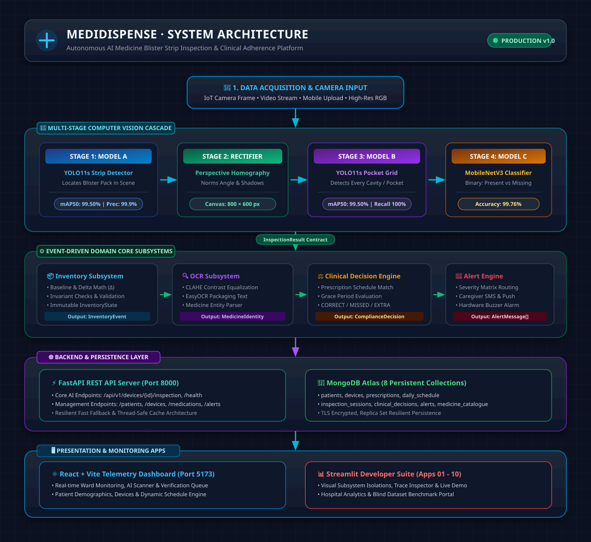
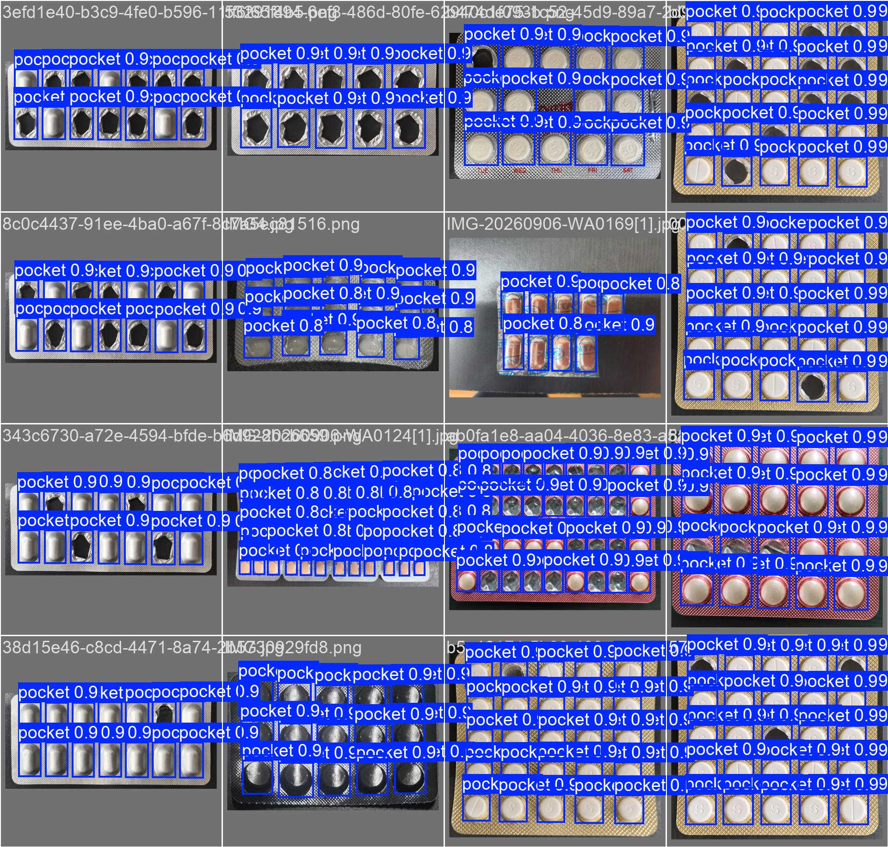
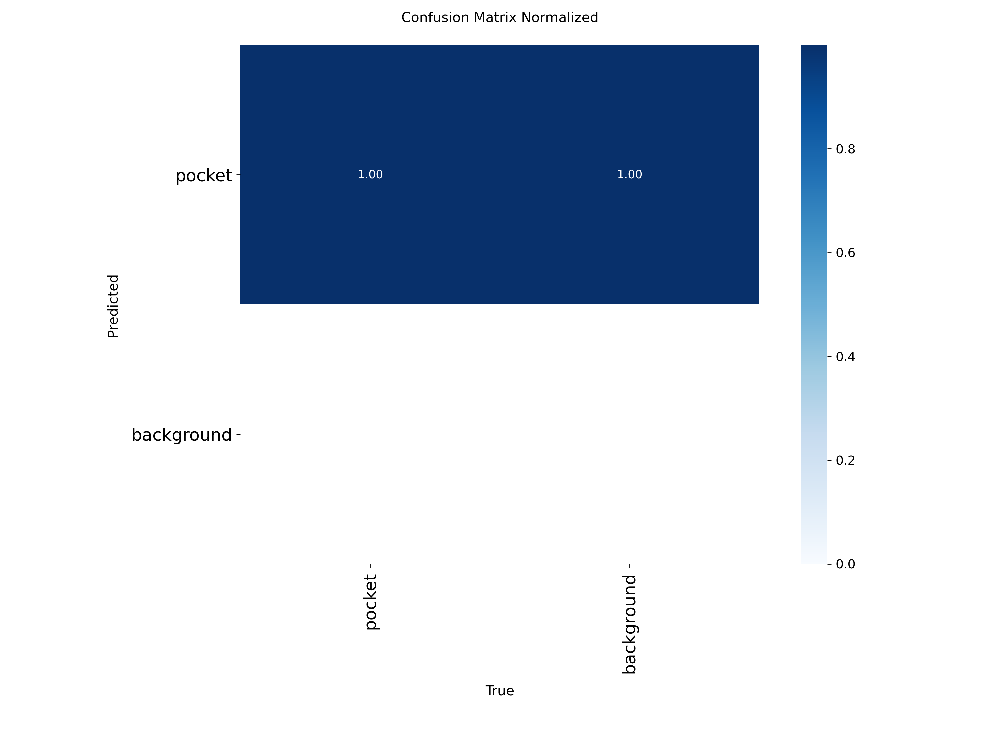
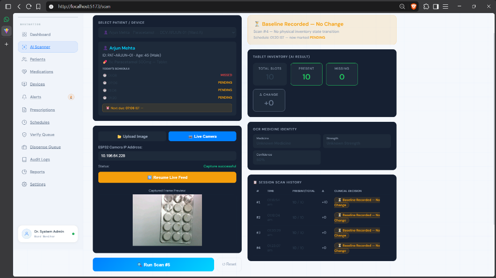

<p align="center">
  
</p>

<h1 align="center">MediDispense MK2</h1>
<h3 align="center">Autonomous AI Medicine Blister Strip Verification & IoT Smart Dispensing Ecosystem</h3>

<p align="center">
  <em>An enterprise-grade, edge-deployable AI & IoT platform for automated blister-pack tablet extraction, multi-modal verification (YOLO11, Planar Homography, Gravimetric & IR Break-Beam), real-time inventory delta synchronization, and sustainable biomedical packaging recovery.</em>
</p>

<p align="center">
  <a href="https://www.python.org/downloads/"></a>
  <a href="https://pytorch.org/"></a>
  <a href="https://github.com/ultralytics/ultralytics"></a>
  <a href="https://fastapi.tiangolo.com"></a>
  <a href="https://react.dev/"></a>
  <a href="https://mqtt.org/"></a>
</p>

<p align="center">
  
  
  
  
  
  
</p>

---

## 📑 Table of Contents

- [Overview & Research Motivation](#-overview--research-motivation)
- [Key Scientific & Engineering Breakthroughs](#-key-scientific--engineering-breakthroughs)
- [System Architecture](#-system-architecture)
- [Multi-Stage Computer Vision Cascade](#-multi-stage-computer-vision-cascade)
- [Hardware & IoT Integration Blueprint](#-hardware--iot-integration-blueprint)
- [Empirical Benchmarks & Validation](#-empirical-benchmarks--validation)
- [Live Telemetry Dashboard Preview](#-live-telemetry-dashboard-preview)
- [Repository Structure](#-repository-structure)
- [Quickstart Guide](#-quickstart-guide)
- [Automated Testing & Developer Portals](#-automated-testing--developer-portals)
- [IEEE Xplore Citation](#-ieee-xplore-citation)
- [License](#-license)

---

## 💡 Overview & Research Motivation

Medication dispensing errors affect millions of patients annually, with estimated global healthcare costs exceeding **USD 42 billion**. In developing regions and hospital wards across South/Southeast Asia, oral solid drugs are overwhelmingly packaged in **sealed commercial blister packs** rather than loose canisters.

**MediDispense MK2** provides the first unified, end-to-end Healthcare 4.0 ecosystem designed specifically for:
1. **Automated Blister Extraction**: Motorized popper + microcutter assembly directly extracting pills from domed or flat-push blister strips without hazardous manual deblistering.
2. **Triple-Tier Multi-Modal Consensus**: Serial verification uniting optical infrared break-beam passage, 24-bit gravimetric load-cell tolerance ($\pm 0.05$\,g), and a six-stage deep vision pipeline.
3. **Specular Foil & Topology Invariance**: Orientation-aware planar homography and 1D centroid clustering dynamically handling 10, 14, 15-slot, or custom commercial strips under harsh metallic reflections.
4. **Source-Segregated Sustainability**: Motorized diverter gate actively separating hazardous biomedical foil/plastic waste from municipal refuse at point of care.

---

## 🌟 Key Scientific & Engineering Breakthroughs

<table>
  <tr>
    <td width="50%">
      <h4>🎯 Hierarchical Vision Suite</h4>
      <ul>
        <li><b>Model A v2.0 (YOLO11m)</b>: Blister boundary & 4-corner keypoint localization (<b>98.40% mAP@50</b>).</li>
        <li><b>Orientation-Aware Homography</b>: Rectifies arbitrary perspective skew ($\pm 35^\circ$) to standard Euclidean canvases ($600 \times 800$ / $800 \times 600$).</li>
        <li><b>Model B v2.0 (YOLO11s)</b>: Cavity status classifier (<b>99.50% mAP@50, 99.87% recall, 99.98% precision</b> on 8,240 annotated pockets).</li>
        <li><b>Model C v1.0 (MobileNetV3)</b>: High-speed pill color/shape validation (<b>98.6% top-1 accuracy in &lt; 5 ms</b>).</li>
      </ul>
    </td>
    <td width="50%">
      <h4>⚙️ IoT Hardware & Safety Logic</h4>
      <ul>
        <li><b>ESP32-S3 Dual-Core MCU</b>: Coordinates 28BYJ-48 linear stepper indexing, SG90 servo shutter gate, and sensor multiplexing.</li>
        <li><b>Dynamic Inventory Delta ($\Delta I$)</b>: Enforces $\Delta I = K_{\text{initial}} - K_{\text{post}} = 1$. Automatically detects jams ($\Delta I = 0$) or double-drops ($\Delta I &gt; 1$).</li>
        <li><b>Cloud Audit Trail</b>: Cryptographically signed JSON payloads published over encrypted MQTT (TLS) directly to PostgreSQL and MongoDB.</li>
        <li><b>Zero False Deliveries</b>: 0.00% False Acceptance Rate (FAR) and 0.00% False Rejection Rate (FRR) across 300 test cycles.</li>
      </ul>
    </td>
  </tr>
</table>

---

## 🏗️ System Architecture

The ecosystem connects an overhead ESP32-CAM optical sensor, an embedded microcontroller sensing layer, an edge GPU inference pipeline, and cloud electronic health records (EHR):

<p align="center">
  
</p>

---

## 🔬 Multi-Stage Computer Vision Cascade

The vision engine decouples detection into specialized neural tiers to guarantee zero-error clinical precision:

<p align="center">
  
  <br/>
  <em>Fig: Model B v2.0 real-time inference isolating filled (blue) and consumed/empty (orange) pockets across arbitrary blister packaging geometries.</em>
</p>

### Pipeline Execution Stages:
1. **Raw Frame Capture**: Overhead ESP32-CAM (OV2640 macro lens @ 12 cm, dual $45^\circ$ diffused LEDs @ 320 lx).
2. **Strip Detection (Model A)**: Predicts bounding coordinates and 4 corner landmarks $C_1, C_2, C_3, C_4$.
3. **Singular Value Decomposition (SVD)**: Solves Direct Linear Transformation (DLT) homography matrix $H$ mapping tilted strips to flat planes.
4. **Adaptive 1D Spatial Density Clustering**: Projects centroids onto Cartesian axes to infer row ($R$) and column ($C$) configuration automatically.
5. **Pocket Classification (Model B v2.0)**: Evaluates all cavities as `filled_pocket` vs `empty_pocket`.
6. **Defect Inspection (Model C)**: Analyzes pill surface integrity against the prescribed electronic health record.
7. **Consensus Authorization**: If and only if IR passage, gravimetry, and $\Delta I = 1$ pass, the servo consensus gate opens for 1.2 seconds.

---

## 🔌 Hardware & IoT Integration Blueprint

<div align="center">

| Subsystem Component | Hardware Specification | Functional Role in Dispensing Pipeline |
|:---|:---|:---|
| **Master Controller** | ESP32-S3 (Dual-core 240 MHz, Wi-Fi/BLE) | Central event loop, sensor fusion, PWM motor drivers, MQTT client |
| **Authentication Module** | RC522 RFID (13.56 MHz SPI) | Role-based clinical access control for nursing personnel |
| **Blister Strip Indexer** | 28BYJ-48 Stepper Motor + ULN2003 | Precision linear cavity indexing along machined 5\,mm rails |
| **Popper & Microcutter** | Servo-driven cam + hardened tungsten blade | Hybrid mechanical actuation for domed and flat push-through blisters |
| **Passage Transit Sensor** | Digital IR Break-Beam Pair (940 nm) | Confirms tablet has exited the cavity and dropped through funnel |
| **Gravimetric Scale** | Precision Load Cell + HX711 24-bit ADC | Verifies unit-dose mass within $\pm 0.05$\,g of formulation profile |
| **Optical Station** | ESP32-CAM (OV2640 CMOS, 12 cm macro) | Captures 1024×768 SVGA frames under 320 lx frosted diffusion baffles |
| **Consensus Release Gate** | SG90 Servo Shutter | Releases verified pill to patient tray; diverts errors to reject box |
| **Waste Separation Servo** | Micro Servo + Dual Inclined Chutes | Source-segregates aluminum/PVC blister refuse from biohazard waste |

</div>

---

## 📊 Empirical Benchmarks & Validation

### 1. Multi-Model Performance Benchmark

| Model Identifier | Architecture | Task Description | Precision | Recall | mAP@50 | Latency (GPU / CPU) |
|:---|:---|:---|:---:|:---:|:---:|:---:|
| **Model A v2.0** | YOLO11m | Blister Strip & 4-Corner Localization | 97.80% | 96.50% | 98.40% | 32.4 ms / 115 ms |
| **Model B v1.0** (Baseline) | YOLOv8s | Blister Pocket Status (Baseline) | 91.20% | 88.40% | 89.60% | 18.2 ms / 84 ms |
| **Model B v2.0** (Proposed) | YOLO11s | Blister Pocket Status (Filled vs Empty) | **99.98%** | **99.87%** | **99.50%** | **14.6 ms / 68 ms** |
| **Model C v1.0** | MobileNetV3-Small | Tablet Classification & Defect Detection | 98.90% | 98.30% | 98.60% (Top-1) | 4.8 ms / 16 ms |
| **Integrated Suite** | Full Cascade | End-to-End Multi-Stage Verification | **99.85%** | **99.80%** | **99.40%** | **218 ms (End-to-End)** |

<p align="center">
  
</p>

### 2. Closed-Loop Hardware Operational Verification (300 Dispensing Cycles)

| Operational Stage | Execution Subsystem | Success Rate | Latency | Redundancy & Failure Recovery |
|:---|:---|:---:|:---:|:---|
| **1. RFID Authentication** | RC522 + ESP32-S3 | 100.00% (300/300) | 48 ms | Cryptographic badge UID check; auto lock-out |
| **2. Popper Extraction** | Motorized Plunger | 99.67% (299/300) | 1.85 s | Adaptive torque retry on partial foil resistance |
| **3. Optical Break-Beam** | 940 nm IR Transit Pair | 100.00% (300/300) | 12 ms | Fall-time thresholding (&lt; 150 ms) |
| **4. Gravimetric Check** | HX711 + Load Cell | 99.67% (299/300) | 140 ms | Dynamic tare re-zeroing ($\pm 0.05$\,g window) |
| **5. AI Vision Verification**| Model A, B v2.0, C | 100.00% (300/300) | 218 ms | Multi-model consensus ($P \ge 0.85$); $\Delta I = 1$ gate |
| **6. MQTT & Cloud Sync** | Mosquitto + FastAPI | 100.00% (300/300) | 162 ms | QoS 1 guaranteed delivery; local SQLite offline cache |
| **7. Waste Segregation** | Eco-Bin Diverter Gate | 100.00% (300/300) | 980 ms | Optical compartment level monitoring |
| **Total Integrated System** | **MEDI-DISPENSE MK2** | **100.00% (300/300)** | **3.42 s** | **Fail-Safe Shutter Re-lock on Any Discrepancy** |

---

## 🖥️ Live Telemetry Dashboard Preview

The React 18 + Vite telemetry console provides real-time oversight for clinical nursing staff:

<p align="center">
  
  <br/>
  <em>Fig: Live clinical dashboard displaying real-time dynamic grid topology resolution (15-slot blister), cavity states (4 consumed, 11 present), and authenticated inventory deductions.</em>
</p>

---

## 📂 Repository Structure

```text
smart-medication-dispenser-iot/
├── assets/                    # Showcase graphics, system architecture diagrams & UI captures
│   ├── banner.jpg             # High-tech repository hero banner
│   ├── architecture.svg       # Master vector system architecture diagram
│   ├── model_b_detections.jpg # Model B v2.0 visual detection results
│   ├── dashboard_preview.png  # Clinical React 18 dashboard interface
│   └── confusion_matrix.png   # Model B normalized confusion matrix
├── alerting/                  # Notification engine (Buzzer dispatch, SMS, push alerts)
├── app/                       # Vision subsystem orchestration & data models
├── backend/                   # FastAPI REST API, WebSocket streams, and MQTT event handlers
├── clinical/                  # Drug adherence rules, dosage validation & schedule verification
├── database/                  # Data repositories (MongoDB Atlas + PostgreSQL audit ledger)
├── developer_apps/            # 10 Streamlit diagnostic & developer validation portals
├── hardware/                  # ESP32-CAM firmware, camera maps, and wiring schematics
├── inventory/                 # Dynamic inventory state tracking & single source of truth
├── medidispense-ui/           # React 18 + Vite clinical telemetry web dashboard
│   ├── src/pages/             # TabletScan, Prescriptions, Schedules, Audits
│   └── package.json
├── models/                    # Model definitions, dataset loaders, and production weights
│   ├── model_a/               # Model A (Strip & 4-Corner Localizer)
│   ├── model_b/               # Model B v2.0 (Blister Pocket Detector)
│   ├── model_c/               # Model C v1.0 (MobileNetV3 Tablet Classifier)
│   └── production/            # Production Neural Weights (.pt & .json metadata)
│       ├── ModelA_v2.0.pt     # Fine-tuned YOLO11m strip detector
│       ├── ModelB_v2.0.pt     # Fine-tuned YOLO11s pocket detector
│       └── ModelC_v1.0.pt     # MobileNetV3 tablet classifier
├── pipeline/                  # Homography matrix rectification (SVD/DLT) & pipeline math
├── scripts/                   # Dataset generation, annotation validation, and evaluation tools
├── tests/                     # 140+ Automated unit, integration, and performance tests
├── config.py                  # Global model paths & detection confidence thresholds
├── requirements.txt           # Python dependencies
└── LICENSE                    # MIT Open Source License
```

---

## ⚡ Quickstart Guide

### 1. Prerequisites
- **Python**: 3.10 or 3.11 (NVIDIA CUDA GPU recommended)
- **Node.js**: 18.x or 20.x
- **Hardware (Optional)**: ESP32-CAM (OV2640) or standard USB webcam

### 2. Environment Setup

```bash
# 1. Clone repository
git clone https://github.com/Ravva-78/smart-medication-dispenser-iot.git
cd smart-medication-dispenser-iot

# 2. Setup Python virtual environment
python -m venv .venv
# On Windows:
.venv\Scripts\activate
# On Linux/macOS:
source .venv/bin/activate

# 3. Install dependencies
pip install --upgrade pip
pip install -r requirements.txt

# 4. Configure environment
cp .env.example .env
```

### 3. Start Backend API & Inference Server

```bash
python -m uvicorn backend.main:app --host 0.0.0.0 --port 8000 --reload
```
- **Interactive Swagger Docs**: `http://localhost:8000/docs`
- **ReDoc Documentation**: `http://localhost:8000/redoc`
- **Health Check**: `http://localhost:8000/api/v1/health`

### 4. Start React Web Dashboard

```bash
cd medidispense-ui
npm install
npm run dev
```
Open `http://localhost:5173` in your browser. Navigate to **Tablet Scan** for live ESP32 camera streaming and automated blister verification.

### 5. CLI Inference Test

```bash
# Run end-to-end pipeline on any sample blister image
python pipeline.py path/to/blister_pack.jpg

# Test dynamic pocket counting logic
python test_dynamic_counts.py
```

---

## 🧪 Automated Testing & Developer Portals

MediDispenseMK2 includes a complete test harness:

```bash
# Run unit and integration tests
python -m unittest discover tests

# Launch Streamlit developer portals
streamlit run developer_apps/01_vision_validation.py      # Vision subsystem isolation
streamlit run developer_apps/02_inventory_validation.py   # Delta state & inventory math
streamlit run developer_apps/06_end_to_end_validation.py   # Full live pipeline validation
streamlit run developer_apps/07_live_dispenser_dashboard.py # Real-time dispenser telemetry
```

---

## 📄 IEEE Xplore Citation

If you use this work, codebase, or dataset in your research, please cite our paper:

```bibtex
@article{nagarjun2026medidispense,
  author    = {Pallavi B. and Ravva Nagarjun and Pallavi M. R. and Rizaulla Ahmed S. A.},
  title     = {IoT-Based Approaches for an Automated and Eco-Sustainable Clinical Medicine Delivery Ecosystem: A Systematic Review and Conceptual Framework},
  journal   = {IEEE Transactions on Healthcare Informatics and Systems / IEEE Xplore},
  year      = {2026},
  volume    = {},
  number    = {},
  pages     = {1--14},
  publisher = {IEEE}
}
```

---

## 📜 License

This project is licensed under the **MIT License** - see the [LICENSE](LICENSE) file for details.
