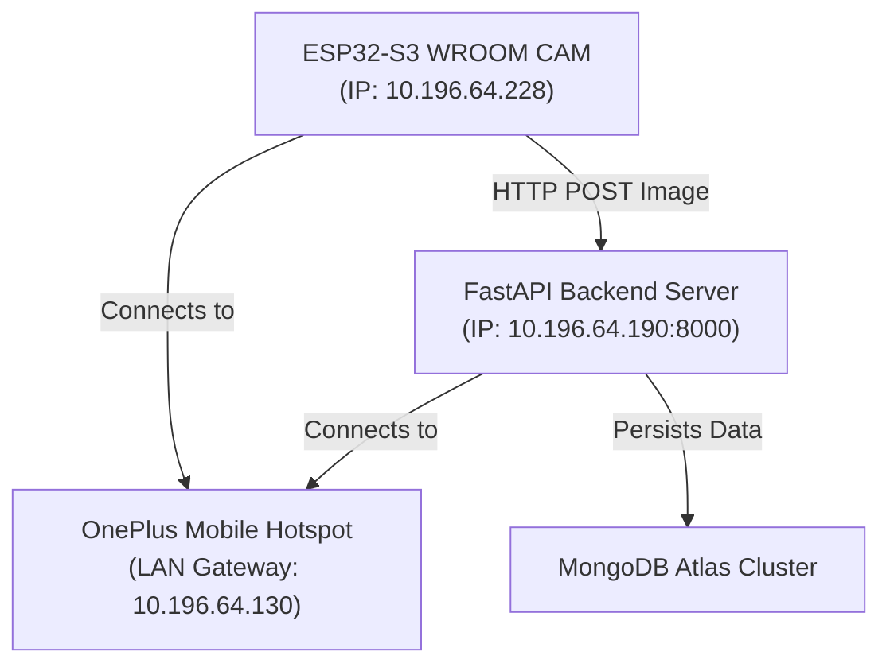

# INTEGRATION MILESTONE: PHYSICAL CAMERA INTEGRATION (PHASES 1 & 2)

**Date:** August 31, 2026  
**Status:** **VERIFIED**

This document serves as the official permanent integration record for the successful validation of the physical ESP32-S3 camera module with the MediDispense MK2 FastAPI backend and MongoDB Atlas.

---

## 1. System Topology & Connectivity

---

## 2. Test Configuration & Parameters

| Component | Parameter | Verified Setting / Value |
| :--- | :--- | :--- |
| **Hardware** | Camera Module | ESP32-S3 WROOM N16R8 + OV2640 Sensor |
| **Interface** | Serial Connection | Port **COM5** @ 115200 baud |
| **Network** | SSID Configuration | `"OnePlu43"` |
| **IP Addresses** | ESP32 Client IP | `10.196.64.228` |
| | Laptop / Backend IP | `10.196.64.190` |
| **API Contract** | Inspection Endpoint | `POST http://10.196.64.190:8000/api/v1/devices/DEV-ARJUN-01/inspection` |
| | Health Endpoint | `GET http://10.196.64.190:8000/api/v1/health` |
| | Multipart Field Name | `file` (binary JPEG payload) |
| **Capture Details** | Capture Format | RGB565 raw format |
| | Resolution | `640x480` (VGA) |
| | Software Conversion | Compressed via `frame2jpg()` |
| | Client Timeout | 15 seconds (`15000ms`) |

---

## 3. Verified Test Run Metrics

*   **HTTP Response Code:** `200 OK`
*   **Transmitted Payload Size:** `21,208 bytes` (Software-compressed JPEG size: `21,057 bytes`)
*   **Upload / Round-Trip Time:** `5,854 ms` (Includes network transit, YOLO object detection, OCR reading, and clinical check)
*   **Database Target Device:** `DEV-ARJUN-01`
*   **Database Target Patient:** `PAT-ARJUN-01` (Arjun Mehta)
*   **Assigned Session ID:** `sess_b1f2b8a9ff`
*   **AI Inference Result:** **10 slots present, 0 missing**
*   **MongoDB Atlas State Update:** **Success**

---

## 4. Working Code & Rollback References
*   **Production Code:** [`hardware/esp32_camera/esp32_camera.ino`](file:///c:/DEV/Projects/College_Projects/ProjectWork/ProjectWork/core/hardware/esp32_camera/esp32_camera.ino)
*   **Phase 2 Backup Point:** [`hardware/esp32_camera/esp32_camera_phase2_backup.bak`](file:///c:/DEV/Projects/College_Projects/ProjectWork/ProjectWork/core/hardware/esp32_camera/esp32_camera_phase2_backup.bak)
*   **Phase 1 Backup Point:** [`hardware/esp32_camera/esp32_camera_phase1_backup.bak`](file:///c:/DEV/Projects/College_Projects/ProjectWork/ProjectWork/core/hardware/esp32_camera/esp32_camera_phase1_backup.bak)
