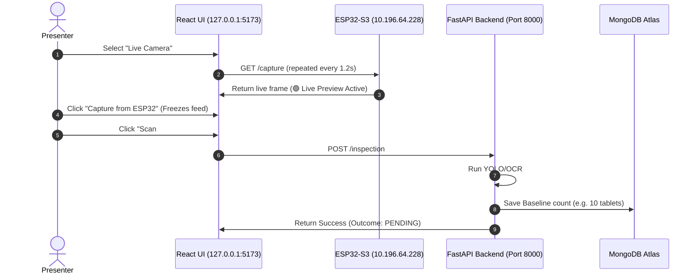

# MediDispense MK2: Presentation & Live Demo Guide

This guide details the startup sequence, project accomplishments, and live presentation test cases for demonstrating your ESP32-S3 IoT Camera and AI Compliance system.

---

## 1. Project Accomplishments (What we built)
1.  **Phase 1 (Hardware Validation):** Configured the physical `ESP32-S3` with an `OV2640` camera. Resolved sensor limitations by capturing raw `RGB565` frames and compressing them in software to `JPEG`.
2.  **Phase 2 (FastAPI Integration):** Created a direct multipart HTTP upload pipeline to post captured JPEGs to the backend API (`POST /api/v1/devices/{device_id}/inspection`), verifying YOLO/OCR processing end-to-end.
3.  **Phase 3 (Live UI Integration):** Exposed a local HTTP WebServer on the ESP32 (Port 80) with a `/capture` endpoint. Upgraded the React frontend page to fetch image blobs directly from the ESP32 in real-time, providing a **live 1.2-second refresh preview** for alignment before freezing and scanning.

---

## 2. Startup Sequence (How to start the demo)

Follow this order when powering on and starting your project:

### Step A: Setup the Network
1.  Turn on your mobile hotspot with SSID **`OnePlu43`** and password **`123456789`**.
2.  Connect your laptop to this same hotspot network.

### Step B: Start the Backend & Frontend
1.  **Start Backend (FastAPI):** Open your terminal in the `core` directory and run:
    ```bash
    uvicorn backend.main:app --host 0.0.0.0 --port 8000 --reload
    ```
2.  **Start Frontend (React):** Open another terminal in the `medidispense-ui` directory and run:
    ```bash
    npm run dev
    ```

### Step C: Power on the ESP32-S3 Camera
1.  Connect the ESP32-S3 board to your laptop's USB port (this powers it up).
2.  The board will automatically connect to your hotspot and start the WebServer.
3.  It will display its IP address on the Serial Monitor: **`10.196.64.228`**.

### Step D: Open the App
*   Open your web browser (Chrome or Brave) and navigate to the explicit IPv4 address:
    **`http://127.0.0.1:5173/scan`**

---

## 3. Presentation Demo Test Cases

For your presentation, use patient **Arjun Mehta** (Device ID: **`DEV-ARJUN-01`**, Prescription: **Paracetamol 500mg - 1 tablet per dose**).



### 📋 Test Case 1: Establish Baseline (Scan #1)
*   **Goal:** Record the initial state of the blister strip.
*   **Preparation:** 
    1. Go to the **Schedules** tab and add a new schedule for Arjun Mehta set **2–3 minutes in the future** (e.g., if it is 02:00, set it to 02:03).
    2. Place a blister strip containing **10 tablets** under the camera.
*   **Execution:**
    1. Go to the **AI Scanner** tab, select patient **Arjun Mehta**.
    2. Select the **Live Camera** tab (verify that the preview refreshes live as you adjust the strip).
    3. Click **📸 Capture from ESP32** to freeze the frame.
    4. Click **🔍 Scan #1 — Establish Baseline**.
*   **Outcome:** 
    *   The UI displays **`Baseline Recorded — No Change`** (Status: `PENDING`).
    *   The baseline is saved in MongoDB. The scan history records `10/10` tablets present.

---

### 📋 Test Case 2: Correct Compliance (Scan #2)
*   **Goal:** Verify the system registers a correct dose taken.
*   **Preparation:**
    1. Wait until the scheduled time begins.
    2. Pop/remove **exactly 1 tablet** from the blister strip (leaving **9 tablets** remaining).
*   **Execution:**
    1. Click **`🔄 Resume Live Feed`** in the UI to reactivate the live preview.
    2. Place the modified strip under the camera.
    3. Click **`📸 Capture from ESP32`** to freeze the new state.
    4. Click **`🔍 Run Scan #2`**.
*   **Outcome:**
    *   The UI turns green and displays **`✅ Correct Dose Taken`**.
    *   The schedule status changes to **`COMPLETED`**.
    *   The AI result confirms `9/10` present (`-1` change).

---

### 📋 Test Case 3: Overdose Detection (Scan #2 - Alternate Path)
*   **Goal:** Verify the system alerts caregivers if too many tablets are taken.
*   **Preparation:**
    *   *Follow Test Case 1 first to set a baseline of 10.*
    *   Instead of removing 1 tablet, remove **2 or more tablets** (leaving **8 or fewer tablets** remaining).
*   **Execution:**
    1. Click **`🔄 Resume Live Feed`**.
    2. Capture the strip under the camera and click **`📸 Capture from ESP32`**.
    3. Click **`🔍 Run Scan #2`**.
*   **Outcome:**
    *   The UI turns red and displays **`⚠️ Overdose — Extra Tablets Removed`** (Status: `EXTRA_DOSE`).
    *   An overdose alert is generated and dispatched to the caregiver's log.

---

### 📋 Test Case 4: Missed Dose Detection (Scan #2 - Alternate Path)
*   **Goal:** Verify the system reports a missed dose if no tablets are taken within the grace period.
*   **Preparation:**
    *   *Follow Test Case 1 first to set a baseline.*
    *   Do **not** remove any tablets. Wait until the schedule's grace window expires (e.g. 1 minute past schedule).
*   **Execution:**
    1. Click **`📸 Capture from ESP32`** showing the same baseline strip.
    2. Click **`🔍 Run Scan #2`**.
*   **Outcome:**
    *   The UI turns red and displays **`❌ Dose Missed`** (Status: `DOSE_MISSED`).
    *   A missed dose alert is successfully generated and recorded in the database.
