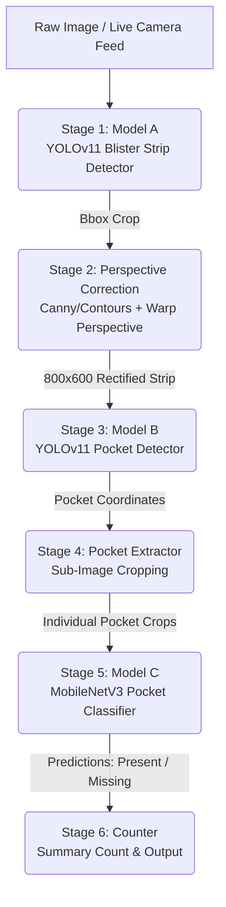

# Blister Strip Inspection System (Model A, B, & C) — Comprehensive Technical Analysis

This document provides a detailed breakdown of the **Blister Strip Detector** codebase, detailing its core objectives, architectural pipeline, file structure, and step-by-step processing mechanics.

---

## 1. Project Overview & Problem Solved

### What is the Project?
This project is an **end-to-end, multi-stage computer vision and deep learning inspection system** designed to automatically detect blister packs, locate individual pill pockets, and classify whether each pocket contains a pill (`present`) or is empty (`missing`).

### What Problem Does it Solve?
In automated medical dispensing, pharmaceutical packaging, and patient adherence tracking, quality control is paramount. Real-world images of medicine blister packs suffer from challenges such as:
1. **Varying orientations and perspective angles** due to camera positioning.
2. **Reflective foils and lighting variations** that confuse simple color or threshold-based computer vision algorithms.
3. **Complex patterns** (text, embossed numbers, colored pill combinations) that require robust feature learning.

By breaking the problem down into a hierarchical sequence of models (detection $\rightarrow$ rectification $\rightarrow$ local detection $\rightarrow$ classification), this codebase achieves high accuracy and robustness under varying real-world conditions.

---

## 2. End-to-End System Pipeline Architecture

The system utilizes an orchestrator pipeline consisting of **three deep learning models** and **one geometric processing stage**:



### Stage-by-Stage Breakdown:

1. **Stage 1: Blister Strip Detection (Model A)**
   - **Model:** YOLOv11s Object Detector.
   - **Task:** Locate the general bounding box of one or more blister packs in a larger, noisy background frame.
   
2. **Stage 2: Perspective Correction (OpenCV)**
   - **Task:** Straighten the cropped blister pack image.
   - **Logic:** Converts the crop to grayscale, applies a Gaussian Blur and Canny edge detector, finds contours, approximates the largest four-point quadrilateral, and applies a perspective warp transform. This standardizes all strips into a unified, flat, vertical representation of `800x600` pixels, eliminating rotation and perspective skew.

3. **Stage 3: Blister Pocket Detection (Model B)**
   - **Model:** YOLOv11s Object Detector.
   - **Task:** Locate every individual tablet/capsule pocket (the physical bubble cavity) on the rectified `800x600` blister strip.
   
4. **Stage 4: Pocket Extractor (OpenCV Utility)**
   - **Task:** Crop each pocket sub-image out of the rectified blister pack using the bounding boxes predicted by Model B.
   
5. **Stage 5: Pocket Classification (Model C)**
   - **Model:** PyTorch MobileNetV3 Small (pre-trained on ImageNet, fine-tuned as a 2-class classifier).
   - **Task:** Perform binary classification on each pocket sub-image to determine if it is `present` (contains medication) or `missing` (empty slot).
   
6. **Stage 6: Counter & Aggregator**
   - **Task:** Aggregate the classifications to count the total pockets, how many have pills, how many are empty, and calculate the average prediction confidence score.

---

## 3. Directory Structure

Below is the directory tree of the workspace (excluding `Annotation_Packages`):

```
ModelA_BlisterStripDetector/
├── config.py                 # Global configurations & thresholds
├── data.yaml                 # Dataset configurations for Model A (blister_strip)
├── dataset/                  # Dataset for Model A training
│   ├── images/               # {train, val, test} directories
│   ├── labels/               # YOLO .txt annotations {train, val, test}
│   └── data.yaml             # Symbolic link / copy of dataset configuration
├── detect_camera.py          # Real-time webcam inference utilizing Model A
├── detect_image.py           # Single-image inference utilizing Model A
├── evaluate.py               # Evaluates Model A performance
├── experiments/              # Local experiments and initial datasets
│   ├── auto_label_test/      # Automatic annotation test runs
│   └── initial_train/        # Folder structure for historical first training run
├── export_model.py           # Exports Model A to ONNX, TensorRT, etc.
├── Model_B/                  # Sub-system for pocket detection (Stage 3)
│   ├── create_strip_crops.py # Generates Model B training data using Model A
│   ├── crop_report.json      # Logs the success/fail crops of Model A on dataset
│   ├── dataset/              # Dataset for Model B (blister_pocket)
│   ├── labels/               # Bbox labels for pocket dataset
│   ├── modelB_dataset/       # Raw strip crop image database
│   ├── pocket_annotator.py   # OpenCV interactive annotator tool for pockets
│   ├── runs/                 # Model B YOLO training runs
│   ├── yolo11s.pt            # YOLOv11 small base weights
│   └── yolo26n.pt            # Pre-trained YOLO weights
├── Model_C/                  # Sub-system for pocket classification (Stage 5)
│   ├── counter.py            # Simple present/missing accumulator
│   ├── dataset/              # Sorted classification crops (present vs missing)
│   ├── evaluate.py           # Evaluates Model C classifier
│   ├── model_c.pt            # Trained PyTorch MobileNetV3 Small weights
│   ├── predict.py            # PyTorch inference class for crops
│   ├── scripts/
│   │   ├── pocket_extractor.py # Crops pockets from label coords or prediction coords
│   │   └── sort_crops.py     # Interactive OpenCV sorter tool for label creation
│   └── train.py              # PyTorch train script (MobileNetV3)
├── pipeline/                 # Core pipeline modules
│   ├── __init__.py           # Sub-package init
│   ├── inspection_result.py  # Output dataclasses (results & stage debug frames)
│   └── perspective.py        # OpenCV-based perspective warp module
├── pipeline.py               # E2E Inspection pipeline main entry point
├── README.md                 # System overview and quickstart guide
├── requirements.txt          # Python library dependencies
├── runs/                     # Model A training runs
├── yolo11s.pt                # Base YOLOv11 model weights
└── yolo26n.pt                # Helper base YOLO weights
```

---

## 4. Comprehensive File-by-File Analysis

### 4.1 Root Directory Files

#### config.py
- **Role:** Defines global environment settings, input parameters, and absolute paths for Model A, B, and C weights.
- **Key Features:**
  - Sets confidence thresholds (`CONF_MODEL_A = 0.25`, `CONF_MODEL_B = 0.35`, `CONF_MODEL_C = 0.50`).
  - Sets size constraint (`MODEL_C_IMG_SIZE = 224` for MobileNetV3).
  - Configures perspective transform dimensions (`PERSPECTIVE_WIDTH = 800`, `PERSPECTIVE_HEIGHT = 600`) and toggles perspective correction (`PERSPECTIVE_ENABLED = True`).

#### data.yaml
- **Role:** Configures the YOLOv11 training directories and classes for **Model A** (Blister Strip Detector).
- **Classes:** Index `0` maps to class `blister_strip`.

#### detect_camera.py
- **Role:** Runs live inference from a connected webcam.
- **Key Features:**
  - Streams frames using OpenCV's `cv2.VideoCapture()`.
  - Runs Model A (YOLOv11) on each frame to detect blister packs.
  - Automatically crops and saves high-confidence blister strip ROIs (`--roi-conf`, default `0.7`) to a local folder (`runs/detect/camera_rois/`).
  - Renders live overlays showing the FPS counter and current ROI save stats.

#### detect_image.py
- **Role:** Runs offline inference on a single static image using Model A.
- **Key Features:**
  - Automatically draws bounding boxes and confidence flags on the input image.
  - Saves the resulting annotated image to `runs/detect/` and exports cropped blister strip sub-regions (ROIs) to `runs/detect/rois/`.

#### evaluate.py
- **Role:** Script to evaluate Model A (YOLOv11 detector) on specified dataset splits (`val` or `test`).
- **Key Features:**
  - Calls `model.val()` from Ultralytics.
  - Computes and displays validation metrics: Precision, Recall, mAP50, mAP50-95, and F1-score.
  - Outputs a detailed validation summary in `evaluation_metrics.json`.

#### export_model.py
- **Role:** Exports trained PyTorch weights (`.pt`) of Model A into high-performance model formats for embedding or server deployments.
- **Supported Targets:** ONNX, TorchScript, and TensorRT.
- **Key Features:**
  - Supports half-precision (`--half`) for FP16 inference optimizations.
  - Configurable input resolution size (default `640`).

#### pipeline.py
- **Role:** The **main orchestrator class** (`Pipeline`) executing the end-to-end multi-stage inspection flow.
- **Key Features:**
  - Loads Model A, B, and C automatically using `Pipeline.from_defaults()` by looking at `config.py` definitions.
  - Sequentially feeds the outputs of one stage to the inputs of the next.
  - Extracts the pocket sub-images in-memory using `pocket_extractor.py` and feeds the batched pocket images to Model C (`predict_batch`) in a single step for faster GPU/CPU processing.
  - Returns a detailed `InspectionResult` containing pocket labels, bounding box coordinates, and debugging stages.

#### requirements.txt
- **Role:** Specifies necessary third-party package dependencies, including `ultralytics`, `opencv-python`, `torch`, `torchvision`, `onnx`, and `onnxruntime-gpu`.

#### train.py
- **Role:** Handles model training for **Model A**.
- **Key Features:**
  - Runs a robust check `validate_labels` on start to verify that all split images contain corresponding, non-empty YOLO annotation `.txt` files.
  - Custom training variables: custom seed control for reproducibility, deterministic mode activation, learning rate parameters, cosine learning rate scheduler option, and mixed-precision (AMP) flags.

---

### 4.2 Pipeline Modules (`pipeline/`)

#### pipeline/__init__.py
- **Role:** Initializes the `pipeline` directory as a python module package.

#### pipeline/inspection_result.py
- **Role:** Structurizes internal data schemas using python `@dataclass`.
- **Key Components:**
  - `PocketResult`: Records individual pocket data (index, class: `present`/`missing`, confidence, bounding box coordinates).
  - `StageImages`: Holds reference frames at each stage (raw input, cropped strip, rectified warp, pocket detections) for visual debugging.
  - `InspectionResult`: Holds the overall summary counts (`total`, `present`, `missing`), list of `PocketResult` entries, and the debugging `StageImages` payload. Contains a `to_dict()` converter helper.

#### pipeline/perspective.py
- **Role:** Corrects angular perspective distortion of blister strips.
- **How it Works:**
  - Applies a Gaussian Blur and Canny edge detector to highlight pack boundaries.
  - Calls `cv2.findContours` to retrieve outer borders.
  - Approximates the polygon shape of contours using `cv2.approxPolyDP` to isolate the four corners of the blister strip.
  - Re-orders the coordinates (`_order_corners`) to: Top-Left, Top-Right, Bottom-Right, Bottom-Left.
  - Executes OpenCV perspective transform (`cv2.getPerspectiveTransform` and `cv2.warpPerspective`) to map the skewed region into a standard flat rectangle of size `PERSPECTIVE_WIDTH x PERSPECTIVE_HEIGHT` (e.g., `800x600`).

---

### 4.3 Model B Directory (`Model_B/`)

Model B is responsible for **Pocket Detection** (Stage 3).

#### Model_B/create_strip_crops.py
- **Role:** Data pre-processing script to generate Model B's training images.
- **How it Works:**
  - Evaluates raw medicine blister images using Model A (Strip Detector).
  - Extracts the strip, applies an **8% padding** buffer around it to ensure the edges are not cut off, and exports the crop to `Model_B/modelB_dataset`.
  - Saves a summary audit sheet (`crop_report.json`) tracking which crops succeeded, failed, or fell below a `0.3` confidence threshold.

#### Model_B/crop_report.json
- **Role:** Logs execution statistics from `create_strip_crops.py`.

#### Model_B/pocket_annotator.py
- **Role:** An interactive, desktop-based GUI tool written in OpenCV to easily draw, adjust, and tag bounding boxes around blister pockets.
- **Key Features:**
  - Incorporates classical computer vision auto-detection (`auto_detect_pockets` using adaptive thresholding, morphological closing/opening, contour tracking, ellipse fitting, and Non-Maximum Suppression) to automatically pre-annotate pocket bounding boxes.
  - Allows human operators to drag, resize, delete (`Del`/`D`), add (`A`), or fine-tune boxes via mouse controls.
  - Pressing `S` or `N` saves annotations directly into YOLO format (`0 xc yc w h`) in `Model_B/labels/`.

---

### 4.4 Model C Directory (`Model_C/`)

Model C is responsible for **Pocket Classification** (Stage 5).

#### Model_C/counter.py
- **Role:** Evaluates individual pocket classification outputs and returns an aggregated dictionary mapping total pocket counts, present pills, and missing pills.

#### Model_C/evaluate.py
- **Role:** Computes detailed classification metrics for Model C (MobileNetV3).
- **Key Features:**
  - Loads validation dataset split.
  - Computes global accuracy, class F1-scores, recall, precision, and AUC-ROC score.
  - Generates and saves a confusion matrix heatmap (`eval_confusion.png`).

#### Model_C/predict.py
- **Role:** Standard inference module for the MobileNetV3 Small classifier.
- **Key Features:**
  - Loads the PyTorch model (`model_c.pt`) with custom classifier heads mapping to 2 target outputs: `present` and `missing`.
  - Normalizes crops utilizing standard ImageNet mean and standard deviation tensors.
  - Implements batched prediction (`predict_batch`) to process multiple pocket crops simultaneously, avoiding overhead.

#### Model_C/train.py
- **Role:** Complete custom training environment script for training Model C in PyTorch.
- **Key Features:**
  - Defines `PocketDataset` loader to import sorted crops from folders `dataset/{train,val}/{present,missing}`.
  - Configures data augmentations: Random Horizontal Flips, Random Affine transformations (rotation, translation, scaling), and Color Jitter (adjusting brightness/contrast).
  - Loads pre-trained `MobileNet_V3_Small_Weights.IMAGENET1K_V1` and substitutes the final linear head layer to match 2 classes.
  - Uses `AdamW` optimizer and a `CosineAnnealingLR` scheduler.
  - Implements early stopping based on validation accuracy with a custom patience threshold (default `15`).
  - Automatically exports the best model weight to `model_c.pt` and generates a confusion matrix chart (`confusion_matrix.png`).

#### Model_C/scripts/pocket_extractor.py
- **Role:** Supporting library containing utilities to crop pocket sub-images out of rectified blister pack images.
- **Key Features:**
  - Adapts to multiple box input formats: pixel-level coordinate arrays `(x1, y1, x2, y2)`, normalized YOLO formats `(xc, yc, w, h)`, and Ultralytics `Results` payloads.
  - Includes a CLI function to parse YOLO label folders and batch extract raw crops to disk (`Model_C/dataset/raw_crops`) to build training data.

#### Model_C/scripts/sort_crops.py
- **Role:** Simple interactive sorting tool.
- **How it Works:**
  - Displays pocket images from `raw_crops` one-by-one in an OpenCV window.
  - Pressing `P` moves the crop image into the `present/` training folder.
  - Pressing `M` moves it into the `missing/` training folder.
  - Pressing `N` skips the crop, and `B` navigates backward, enabling quick and efficient dataset labeling.

---

## 5. Typical Workflow for Re-training the Models

If the user wishes to retrain the pipeline from scratch on new data, the workflow proceeds as follows:

1. **Annotate & Train Model A (Blister Strip Detection):**
   - Gather raw images of blister packs.
   - Annotate using `LabelImg` with class `blister_strip`.
   - Run `python train.py` to train Model A.
2. **Prepare Dataset & Train Model B (Pocket Detection):**
   - Run `python Model_B/create_strip_crops.py` to crop blister strips using Model A.
   - Run `python Model_B/pocket_annotator.py` to automatically pre-annotate pocket bounding boxes and manually adjust/save them.
   - Train Model B using YOLOv11 on the annotated pocket dataset.
3. **Prepare Dataset & Train Model C (Pocket Classification):**
   - Run `python Model_C/scripts/pocket_extractor.py` to crop pocket CAV regions using Model B's labels.
   - Run `python Model_C/scripts/sort_crops.py` to sort pocket crops into `present` vs `missing` folders.
   - Run `python Model_C/train.py` to train the MobileNetV3 classifier.
4. **Run End-to-End Inspection:**
   - Execute `python pipeline.py <image_path>` to inspect a blister pack.
